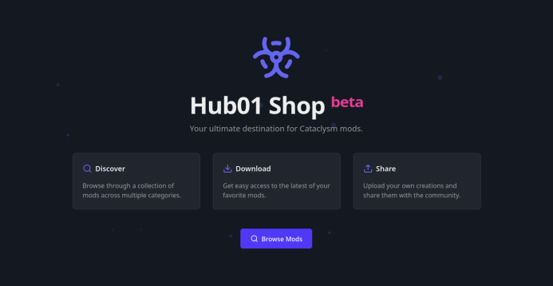

<p align="center">
  
</p>

# Hub01 Shop

A Cataclysm Games project repository and management platform.

[https://hub01-shop.srgnis.com/](https://hub01-shop.srgnis.com/)

## About Hub01 Shop

Hub01 Shop is a web application designed to serve as a centralized repository for Cataclysm Games projects. It provides a platform for project creators to share their work and for players to discover, download, and manage projects for their CDDA game.

### Key Features

- **Project Repository**: Browse, search, and download projects for Cataclysm Games
- **Version Management**: Track different versions of projects with changelog support
- **User Accounts**: Register, login, and manage your profile
- **Project Management**: Create and manage your mod projects
- **Dependency Tracking**: Manage mod dependencies to ensure compatibility
- **Tagging System**: Organize projects with tags for better discoverability
- **REST API**: Access project data programmatically
    - **API Documentation**: [https://hub01-shop.srgnis.com/docs/api/](https://hub01-shop.srgnis.com/docs/api/)
    - **API Specification**: [OpenAPI](https://raw.githubusercontent.com/SrGnis/hub01-shop/refs/heads/main/src/public/api.json)
    - **API Client**: [Hub01 Shop API libs](https://github.com/SrGnis/Hub01-Shop-API-libs)
    - **API Tools**: [Hub01 Shop API Tools](https://github.com/SrGnis/Hub01-Shop-API-Tools)

## Tech Stack

The application is built with:

- TALL Stack
    - [Tailwind CSS](https://tailwindcss.com/)
    - [Alpine.js](https://alpinejs.dev/)
    - [Laravel](https://laravel.com/)
    - [Livewire](https://livewire.laravel.com/)
- [Own fork](https://github.com/SrGnis/mary) of [MaryUI](https://mary-ui.com/)
- Docker for containerization
- MariaDB for database
- Redis for caching

## Development

The project development environment is containerized using Docker. But you can also run it as a regular Laravel application.

### Quick Start

```bash
# Clone the repository
git clone --recursive https://github.com/srgnis/hub01-shop.git

# Navigate to the project directory
cd hub01-shop

# Copy the environment file
cp .env.example .env

# Start the Docker containers
./scripts/dcdev up -d

# Run migrations and seed the database
./scripts/cr php artisan migrate:fresh --seed
```

The application will be available at [http://localhost:8000](http://localhost:8000).

### Development Environment

The development environment is containerized in the [docker-compose-dev.yml] and consists of the following Docker services:

- **app**: PHP-Apache service running the Laravel application (port 8000)
- **db**: MariaDB database
- **redis**: Redis cache server
- **adminer**: Database management tool (port 8080)
- **mailpit**: Development mail server (port 8025)

#### Helper Scripts

The project includes helper scripts to simplify common tasks:

- `./scripts/dcdev`: Run Docker Compose commands with the dev configuration

```bash
./scripts/dcdev up -d
```

- `./scripts/cr`: Run commands in the docker containers

```bash
./scripts/cr php artisan tinker
```

### Project Structure

The application follows a standard Laravel + Livewire structure:

- **Models**: Representations of the database entities like Project, ProjectType, ProjectVersion, ProjectFile, etc.
    - Found in the `src/app/Models` directory
- **Services**: Business logic layer
    - Found in the `src/app/Services` directory
- **Livewire Components**: For reactive UI components
    - Found in the `src/app/Livewire` directory and `src/resources/views/livewire`
- **Controllers**: Handle HTTP requests and responses
    - Found in the `src/app/Http/Controllers` directory

### CI/CD

This project uses GitHub Actions for continuous integration and deployment:

- **Docker Image Build**: Automatically builds and publishes the application Docker image to GitHub Container Registry (GHCR) when changes are pushed to the main branch.
- **Image Tags**: Images are tagged with:
    - `latest`: Always points to the most recent build from the main branch
    - `sha-<commit>`: Specific commit hash for precise version tracking
    - Branch name: When building from a specific branch

## Deployment

For production deployment, copy the `docker-compose.yml` and the `.env.example` file to your production environment, adjust the configuration as needed and specify the desired version of the container image.

### Using the Container Image

You can pull the container image from GitHub Container Registry:

```bash
docker pull ghcr.io/srgnis/hub01-shop:latest
```

To use a specific version:

```bash
docker pull ghcr.io/srgnis/hub01-shop:sha-<commit_hash>
```

## Documentation

Additional documentation can be found in the `docs/` directory:

- [Database Schema](docs/Hub01%20Shop.svg): Entity relationship diagrams
- [GitHub Actions](docs/GITHUB_ACTIONS.md): CI/CD workflow details

## Disclaimer

This project contains LLM generated code.

## License

This project is open-sourced software licensed under the [MIT license](https://opensource.org/licenses/MIT).
