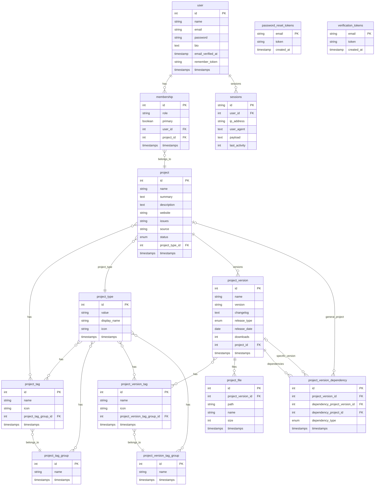

```mermaid
erDiagram

    user {
        int id PK
        string name
        string email
        string password
        text bio
        timestamp email_verified_at
        string remember_token
        timestamps timestamps
    }

    password_reset_tokens {
        string email PK
        string token
        timestamp created_at
    }

    verification_tokens {
        string email PK
        string token
        timestamp created_at
    }

    sessions {
        string id PK
        int user_id FK
        string ip_address
        text user_agent
        text payload
        int last_activity
    }

    project {
        int id PK
        string name
        text summary
        text description
        string website
        string issues
        string source
        enum status
        int project_type_id FK
        timestamps timestamps
    }

    project_type {
        int id PK
        string value 
        string display_name
        string icon
        timestamps timestamps 
    }

    project_version_tag_group {
        int id PK
        string name
        timestamps timestamps
    }

    project_version_tag {
        int id PK
        string name
        string icon
        int project_version_tag_group_id FK
        timestamps timestamps
    }

    project_version_dependency {
        int id PK
        int project_version_id FK
        int dependency_project_version_id FK
        int dependency_project_id FK
        enum dependency_type
        timestamps timestamps
    }

    membership {
        int id PK
        string role
        boolean primary
        int user_id FK
        int project_id FK
        timestamps timestamps
    }

    project_tag_group {
        int id PK
        string name
        timestamps timestamps
    }

    project_tag {
        int id PK
        string name
        string icon
        int project_tag_group_id FK
        timestamps timestamps
    }

    project_version {
        int id PK
        string name
        string version
        text changelog
        enum release_type
        date release_date
        int downloads
        int project_id FK
        timestamps timestamps
    }

    project_file {
        int id PK
        int project_version_id FK
        string path
        string name
        int size
        timestamps timestamps
    }

    project_type }o--o{ project_tag : has
    project_type }o--o{ project_tag_group : has

    project_type }o--o{ project_version_tag : has
    project_type }o--o{ project_version_tag_group : has
    
    project_version_tag }o--|| project_version_tag_group : belongs_to
    project_version }o--o{ project_version_tag : has

    project_tag }o--|| project_tag_group : belongs_to
    project }o--o{ project_tag : has


    project }o--|| project_type : project_type
    user ||--o{ membership : has
    membership }o--|| project : belongs_to
    project ||--o{ project_version : versions
    project_version ||--o{ project_file : files
    project_version ||--o{ project_version_dependency : dependencies
    project_version_dependency }o--o| project_version : specific_version
    project_version_dependency }o--o| project : general_project
    user ||--o{ sessions : sessions


```
